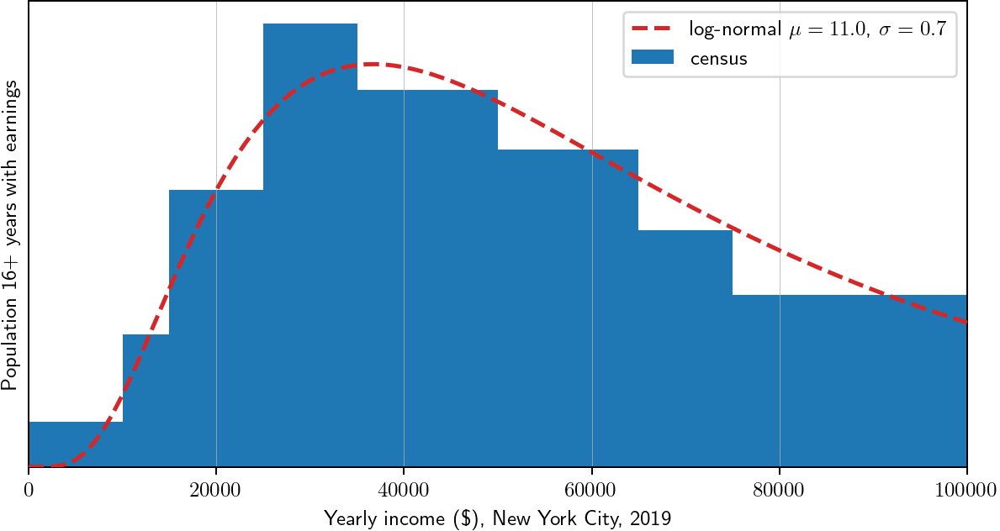

Census data `ACSST1Y2019.S2001_2021-06-21T091003` was downloaded from [data.census.gov](https://data.census.gov/cedsci/table?g=1600000US3651000&tid=ACSST5Y2019.S2001&hidePreview=true&moe=false) on 2021-06-21.
See [PDF file](census_original/ACSST1Y2019.S2001_2021-06-21T091003/printout.pdf).

Processed data is in [this table](a_process/wages.tsv).

We fit a log-normal distribution (by hand)
and use that as our model
for time-is-money conversion.

